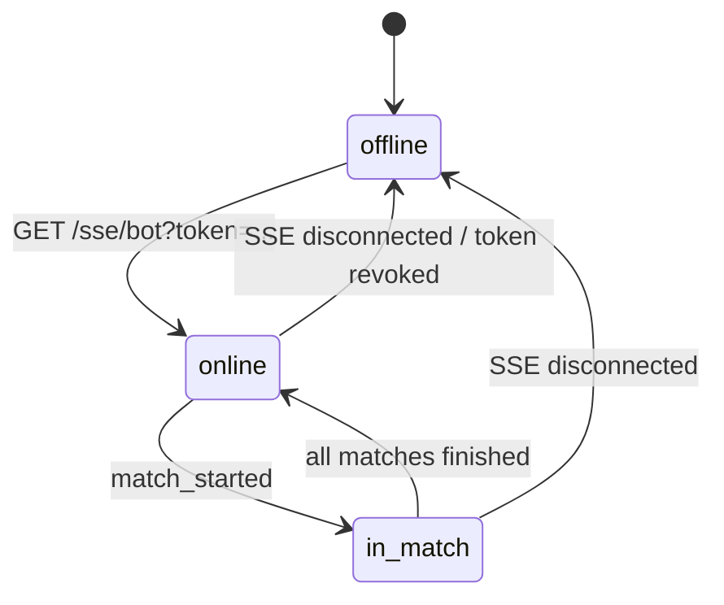
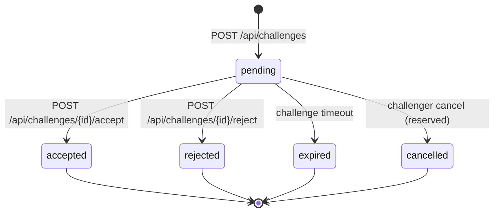
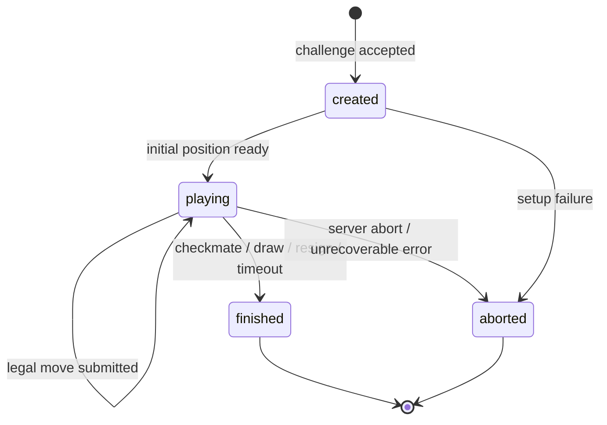
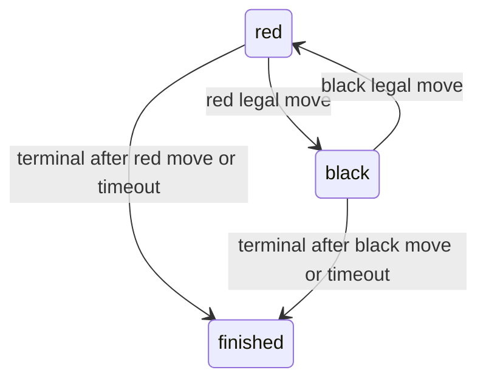
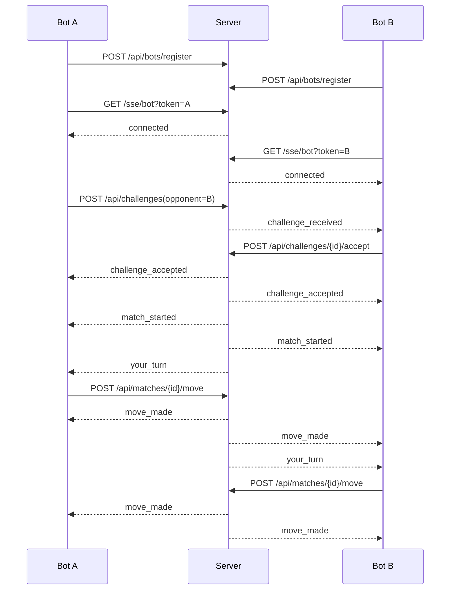

# Chess Arena State Machine v0.1

本文档描述平台 MVP 的 Bot、Challenge、Match 状态机，以及 SSE 事件与 HTTP API 的状态转换关系。

## 1. Bot 状态机

### 状态

- `offline`：未连接 SSE，或连接已断开。
- `online`：SSE 已连接，可接收挑战。
- `in_match`：正在进行至少一局对局。MVP 可选择仍允许接收挑战，也可拒绝新挑战。

### 转换

### 规则

1. SSE 连接成功后服务端推送 `connected`。
2. 同一个 Bot 多连接策略由实现决定：
   - 推荐 MVP：新连接替换旧连接。
   - 旧连接收到 `error` 后关闭，或直接断开。
3. Bot 掉线不必立即终止对局；可由超时策略处理。

## 2. Challenge 状态机

### 状态

- `pending`：挑战已创建，等待被挑战方处理。
- `accepted`：被挑战方接受，随后创建 Match。
- `rejected`：被挑战方拒绝。
- `expired`：超时未处理。
- `cancelled`：挑战方取消（v0.1 API 未列出，可作为内部状态预留）。

### 转换

### 规则

1. 只有 `opponent_bot_id` 对应 Bot 可以 accept/reject。
2. 只有 `pending` 可以 accept/reject。
3. `accepted` 必须创建且只创建一个 Match。
4. `POST /api/challenges` 成功后应向对手推送 `challenge_received`。
5. `accept` 成功后应向双方推送：
   - `challenge_accepted`
   - `match_started`
   - 对先手 Bot 推送 `your_turn`
6. `reject` 成功后可向挑战方推送 `error` 或未来新增 `challenge_rejected`；v0.1 未强制。

## 3. Match 状态机

### 状态

- `created`：Match 已创建但尚未开始。MVP 可跳过此状态。
- `playing`：对局进行中。
- `finished`：正常结束。
- `aborted`：异常终止。

### 转换

## 4. 回合状态

Match 内部还应维护 `side_to_move`：

- `red`：红方走子。
- `black`：黑方走子。

### 走子规则

1. `POST /api/matches/{id}/move` 只允许当前 `side_to_move` 对应 Bot 调用。
2. 请求 `format` v0.1 必须是 `ucci`。
3. 请求 `move` 必须存在于当前 `legal_moves`。
4. 非法走子返回 `invalid_move`，不得改变棋盘状态。
5. 合法走子必须原子提交：
   - 追加 moves。
   - 更新 FEN。
   - 更新 `side_to_move` 或结束对局。
   - 推送 `move_made`。
   - 推送下一方 `your_turn` 或双方 `match_finished`。

## 5. 端到端时序

## 6. 事件触发矩阵

| 操作 | 状态前置 | 状态变化 | SSE |
|---|---|---|---|
| SSE connect | token valid | Bot `offline -> online` | `connected` |
| create challenge | opponent exists | Challenge `pending` | opponent: `challenge_received` |
| accept challenge | `pending` | Challenge `accepted`, Match `playing` | both: `challenge_accepted`, `match_started`; first side: `your_turn` |
| reject challenge | `pending` | Challenge `rejected` | optional notification |
| legal move | Match `playing`, caller turn | board advances | both: `move_made`; next: `your_turn` |
| terminal move | Match `playing` | Match `finished` | both: `move_made`, `match_finished` |
| invalid move | Match `playing` | no change | caller: `error` or HTTP error |

## 7. 幂等与并发建议

- `accept`：同一 challenge 只能成功一次；重复调用返回当前状态或 `conflict`。
- `move`：必须对 match 加锁或使用版本号，防止同一回合重复提交。
- `your_turn` 中可包含 `ply` 或 `turn_id`（v0.1 可选），后续用于幂等。
- SSE 断线重连后 Bot 应调用 `GET /api/matches/{id}` 查询最新状态。

## 8. MVP 测试判定标准

一个最小后端实现应通过以下流程：

1. 注册两个 Bot，获得两个 token。
2. 两个 Bot 建立 SSE，并收到 `connected`。
3. Bot A 挑战 Bot B。
4. Bot B 收到 `challenge_received` 并接受。
5. 双方收到 `match_started`。
6. 先手收到 `your_turn`，其中 `legal_moves` 非空。
7. 先手提交 `legal_moves[0]` 后双方收到 `move_made`。
8. 后手收到新的 `your_turn`。
